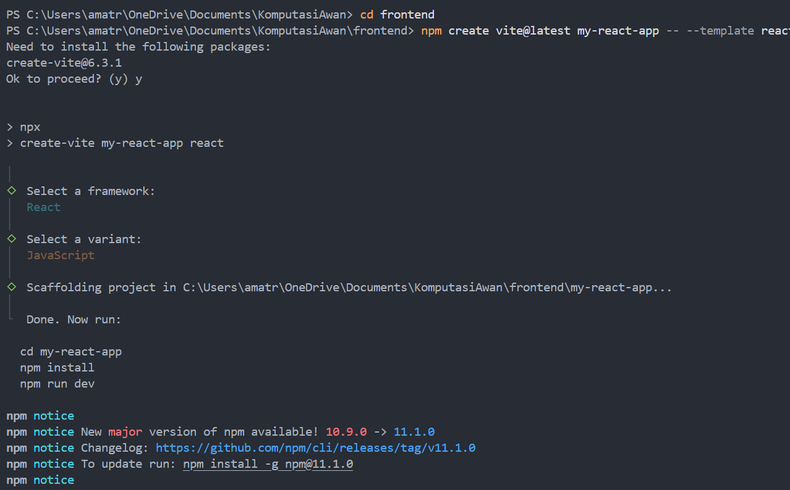
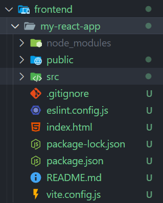
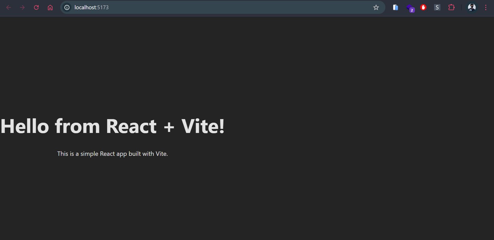

# Panduan Instalasi Flask

## Prasyarat

Pastikan Python 3.6+ terinstal di sistem Anda.

Anda dapat memeriksa versi Python dengan menjalankan:
```bash
python --version
```

Jika Python belum terinstal, Anda dapat mengunduh dan menginstalnya dari situs web resmi Python: https://www.python.org/downloads/

## Langkah Instalasi

1. **Siapkan virtual environment (disarankan tapi opsional)**:
   Sangat disarankan untuk menginstal Flask dalam virtual environment agar terhindar dari konflik dengan paket Python lainnya.

   Untuk membuat virtual environment:
   ```bash
   python -m venv venv
   ```

2. **Aktifkan virtual environment**:
   - Pada Windows:
     ```bash
     venv\Scripts\activate
     ```
   - Pada MacOS/Linux:
     ```bash
     source venv/bin/activate
     ```

3. **Instal Flask**:
   Setelah virtual environment aktif, instal Flask menggunakan pip:
   ```bash
   pip install Flask
   ```

4. **Verifikasi Instalasi**:
   Untuk memverifikasi Flask terinstal dengan benar, Anda dapat membuat aplikasi sederhana "Hello, World!". Buat file `app.py` dengan konten berikut:

   ```python
   from flask import Flask
   app = Flask(__name__)

   @app.route('/')
   def hello_world():
       return 'Hello, World!'

   if __name__ == '__main__':
       app.run(debug=True)
   ```

   Jalankan aplikasi:
   ```bash
   python app.py
   ```

   Buka browser dan buka `http://127.0.0.1:5000/` untuk melihat hasilnya.

## Penanganan Error saat Instalasi

Saat menginstal Flask, Anda mungkin akan menemui beberapa masalah umum. Berikut adalah solusi untuk mengatasi masalah tersebut:

### 1. **Error: `pip: command not found`**
   - Error ini terjadi jika pip belum terinstal. Untuk mengatasi masalah ini, unduh dan instal pip dengan mengikuti panduan resmi: https://pip.pypa.io/en/stable/installation/.

### 2. **Error: `Permission denied`**
   - Jika Anda mendapatkan error izin saat menginstal Flask, Anda bisa mencoba menjalankan perintah instalasi dengan hak akses yang lebih tinggi:
     - Pada Linux/MacOS:
       ```bash
       sudo pip install Flask
       ```
     - Pada Windows, jalankan Command Prompt sebagai Administrator.

### 3. **Error: `ModuleNotFoundError: No module named 'flask'`**
   - Error ini berarti Flask belum terinstal di lingkungan Anda. Pastikan Anda sudah mengaktifkan virtual environment jika menggunakan satu.
   - Jalankan kembali perintah instalasi:
     ```bash
     pip install Flask
     ```

### 4. **Error: `Flask module version is incompatible`**
   - Jika Anda memiliki versi Flask yang lebih lama, perbarui Flask dengan menjalankan:
     ```bash
     pip install --upgrade Flask
     ```

### 5. **Masalah Virtual Environment**
   - Jika Anda mengalami masalah saat mengaktifkan virtual environment, pastikan Anda berada di direktori yang benar tempat `venv` berada. Untuk pemecahan masalah lebih lanjut, periksa versi Python dan pastikan file `Scripts/activate` ada.


# TUGAS 3

 Membuat Aplikasi Frontend Sederhana dengan React + Vite
 menjalankan
```
   cd ../frontend
   npm create vite@latest my-react-app
   --template react
   cd my-react-app
   npm install
   npm run dev
```

makan akan jadi seperti ini pada susunan direktori frontend



ubah tampilan pada file app.jsx dengan code
```js
import React from 'react';

function App() {
  return (
    <div style={{ textAlign: 'center', marginTop: '50px' }}>
      <h1>Hello from React + Vite!</h1>
      <p>This is a simple React app built with Vite.</p>
    </div>
  );
}

export default App;
```

dan ketika menjalankan 

```
npm run dev
```
maka akan menjadi sepert ini




# WEEK 5


## Komponen Utama

### 1. Import dan Dependencies
```python
import psycopg2
from flask import Flask, jsonify, request
```
- `psycopg2`: Library untuk koneksi ke database PostgreSQL
- `Flask`: Framework web Python
- `jsonify`: Fungsi untuk mengubah data Python menjadi respons JSON
- `request`: Objek untuk mengakses data yang dikirim client

### 2. Koneksi Database
```python
def get_db_connection():
    conn = psycopg2.connect(
        host="localhost",
        database="db_test",
        user="student",
        password="1"
    )
    return conn
```
Fungsi ini membuat dan mengembalikan koneksi ke database PostgreSQL dengan parameter:
- Host: localhost (server database lokal)
- Database: db_test
- User: student
- Password: 1

### 3. Inisialisasi Aplikasi Flask
```python
app = Flask(__name__)
```
Membuat instance aplikasi Flask.

### 4. Endpoint Home
```python
@app.route('/')
def home():
    return jsonify({"message": "Hello from Flask!"})
```
- URL: `/`
- Method: GET
- Response: JSON dengan pesan "Hello from Flask!"
- Fungsi: Sebagai endpoint default/landing page

### 5. Endpoint untuk Mengambil Data Items
```python
@app.route('/api/items', methods=['GET'])
def get_items():
    conn = get_db_connection()
    cur = conn.cursor()
    cur.execute("SELECT id, name, description FROM items;")
    rows = cur.fetchall()
    cur.close()
    conn.close()

    items = [{"id": row[0], "name": row[1], "description": row[2]} for row in rows]
    return jsonify(items)
```
- URL: `/api/items`
- Method: GET
- Proses: 
  1. Membuat koneksi ke database
  2. Menjalankan query untuk mengambil semua data dari tabel items
  3. Mengubah hasil query menjadi list dictionary
  4. Menutup koneksi database
- Response: JSON array berisi semua items dari tabel

### 6. Endpoint untuk Membuat Item Baru
```python
@app.route('/api/items', methods=['POST'])
def create_item():
    data = request.json
    name = data['name']
    description = data['description']

    conn = get_db_connection()
    cur = conn.cursor()
    cur.execute("INSERT INTO items (name, description) VALUES (%s, %s) RETURNING id;", (name, description))
    new_id = cur.fetchone()[0]
    conn.commit()
    cur.close()
    conn.close()

    return jsonify({"id": new_id, "name": name, "description": description}), 201
```
- URL: `/api/items`
- Method: POST
- Request Body: JSON dengan field `name` dan `description`
- Proses:
  1. Mengambil data dari request body
  2. Membuat koneksi ke database
  3. Menjalankan query INSERT dan mendapatkan ID baru
  4. Commit transaksi dan menutup koneksi
- Response: JSON dengan data item yang baru dibuat dan status code 201 (Created)

### 7. Menjalankan Aplikasi
```python
if __name__ == '__main__':
    app.run(debug=True, host='0.0.0.0', port=5000)
```
Menjalankan aplikasi Flask dengan:
- Mode debug aktif (untuk development)
- Host `0.0.0.0` (dapat diakses dari luar)
- Port 5000

## Struktur Database

Kode ini mengasumsikan adanya tabel `items` di database `db_test` dengan struktur:
- `id`: Primary key, auto-increment
- `name`: Nama item
- `description`: Deskripsi item

## Catatan Keamanan

1. Koneksi database menggunakan parameter tetap (hardcoded) - dalam produksi sebaiknya gunakan environment variables
2. Tidak ada validasi input pada endpoint POST
3. Tidak ada autentikasi/otorisasi
4. Password database disimpan dalam kode (hardcoded)

## Penggunaan API

### Mengambil Semua Items
```
GET /api/items
```
Response:
```json
[
  {"id": 1, "name": "Item 1", "description": "Deskripsi item 1"},
  {"id": 2, "name": "Item 2", "description": "Deskripsi item 2"}
]
```

### Membuat Item Baru
```
POST /api/items
Content-Type: application/json

{
  "name": "Item Baru",
  "description": "Deskripsi item baru"
}
```
Response:
```json
{
  "id": 3,
  "name": "Item Baru",
  "description": "Deskripsi item baru"
}
```
